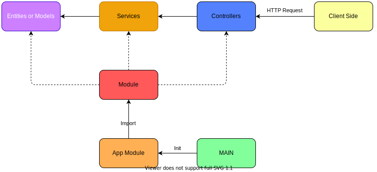

# Introducción a NestJS

En esta sección vamos a hacer un recorrido por la documentación de NestJS, haremos la instalación de Nest CLI e interactuaremos un poco con el mismo, además de crearemos el primer proyecto.

## Cómo funciona NestJS

NestJS es un framework que trabaja a nivel de estructura modular, y se centra mucho en el desarrollo con principios SOLID, en especial con el principio de responsabilidad única y la inyección de dependencias (tiene cierto parecido con Angular). Cuando el lado del cliente hace una solicitud a un proyecto de NestJS, llega la petición HTTP al controlador, el cual usará métodos los servicios que se encargan de manipular o gestionar los datos de las entidades o modelos. Los módulos son los lugares en donde se hará la inyección de dependencias, y cada uno de los modules serán declarados dentro de un App Module que es llamado en el archivo central



## Iniciemos con el proyecto

En la [Documentación de NestJS](https://docs.nestjs.com/) nos indica que la instalación global de la versión estable de Nest CLI se debe hacer con el siguiente comando:

```txt
pnpm i -g @nestjs/cli
```

Podemos observar la versión instalada con el comando a continuación:

```txt
nest -v
```

Podemos acceder a la lista de comandos con solo escribir este comando en la consola:

```txt
next
```

Para crear nuestro primer proyecto usamos este comando (podemos añadir la bandera `--strict` para establecer que TypeScript ejecute en modo estricto), y seleccionamos el manejador de dependencias preferido, en este caso, pnpm:

```txt
nest new <nombre-del-proyecto>
```

Una vez creado el proyecto, ingresamos al mismo y podemos ejecutarlo en modo desarrollo con el comando:

```txt
pnpm start:dev
```

En algún API Client como Postman, Thunder Cliente o RapidAPI podemos hacer la petición inicial al endpoint `http://localhost:3000/`.

Para crear un módulo en el proyecto hacemos uso del CLI y lo generamos con el siguiente comando:

```txt
nest g mo <nombre del módulo> <path opcional>
```

En este caso creamos el módulo de usuarios, por lo que ejecutamos este comando:

```txt
nest g mo users
```

Para generar archivos de servicios es un comando similar, pero por ejemplo para ubicar el archivo en un path personalizado usamos el siguiente comando:

```txt
nest g s users/services/users --flat
```

Con los controladores para igual:

```txt
nest g co users/controllers/users --flat
```

Cómo preferencia, vamos a dejar que la aplicación centralice la lógica dentro del módulo de usuarios, pero todo finalmente apuntará al módulo principal de la app.

___

| Anterior | Readme                 | Siguiente                                                                         |
| -------- | ---------------------- | --------------------------------------------------------------------------------- |
|          | [Readme](../README.md) | [Configuración y variables de entorno](./P2T1_Configuracion_variables_de_entorno) |
